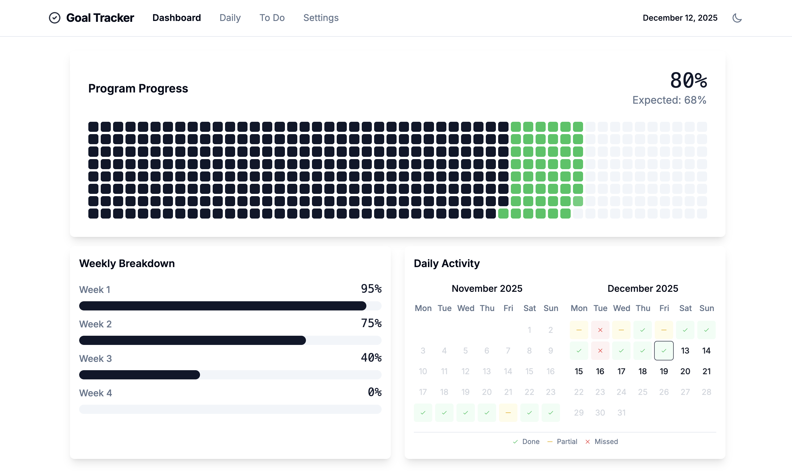

# Goal Tracker

**⚠️ This application was quickly "vibe-coded" and may not adhere to strict production standards or best practices.**

A powerful web application to track program progress with objectives and tasks - designed to keep you motivated and on track with your personal development goals!

## ✨ What Makes This Special?

🎯 **Smart Progress Tracking**: Never wonder if you're on track again! The app calculates your expected vs. actual progress and tells you exactly where you stand.

📊 **Gamified Experience**: Earn points for completing objectives and tasks. Different importance levels multiply your points - making critical goals worth 3x more!

🔄 **Flexible Goal Types**: 
- **Daily habits** (meditation, exercise, reading)
- **Weekly targets** (gym sessions, work meetings)  
- **Program milestones** (finish a course, complete a project)
- **One-time tasks** (organize workspace, update resume)

🎨 **Visual Progress**: Beautiful dashboard showing your overall progress with clear indicators of whether you're ahead or behind schedule.

⚡ **Instant Setup**: Get started in under 2 minutes - define your program duration, add your goals, and start tracking immediately!

## 🚀 Quick Start

1. Install dependencies: `pip install -r requirements.txt`
2. Launch the app: `python app.py`
3. Open `http://localhost:5000` in your browser
4. Set up your first program and start crushing your goals!